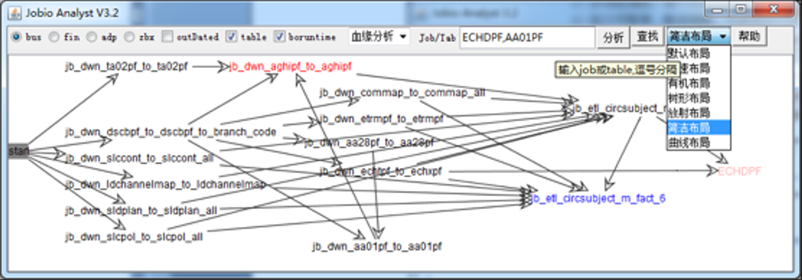
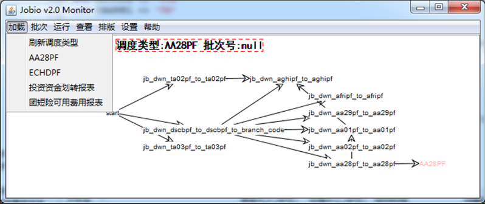

## 血缘/影响分析、作业调度工具（开源）。

### 二、	需求背景
>（1）随着ETL作业越来越多，种类越来越杂（含：DataStage、Kettle、SSIS、procedure、shell脚本等），修改作业需对其进行血缘分析、影响分析，而通过人力进行分析容易出现错漏。  
>（2）ETL作业分为定时作业、顺序作业、并行作业等，作业之间的调度依赖关系不够直观明确，希望实现一套图形界面的作业调度，可通过鼠标拖拉拽进行编辑其依赖关系，并直观地展示出调度的过程。  
### 三、	实现方案
>（1）将ETL作业导出成xml或SQL文件(支持自动导出存储过程)，解析这些文件得到作业的SQL语句。  
>（2）通过分析SQL语句获得作业的输入/输出关系。（3）通过图形界面展示作业间的依赖关系，并支持编辑。  
> 血缘/影响分析工具的特点介绍：
> 可一次输入多个JOB/表名/文件名，进行血缘或影响分析，可在分析出的结果上增加单个JOB的分析，可查看JOB的详细信息及上下游信息。  
> 调度工具的特点介绍：  
> （1）可通过图形进行添加、编辑作业及其依赖关系，所见即所得。  
> （2）多线程调度，每个作业根据作业间的依赖关系，独立运行。  
> （3）批次可暂停、断点续跑，可单独运行指定的作。  

#### 四、	使用的技术
> XML解析：DB2的XQuery(2.0之前的版本使用Java解析Xml文件，效率太慢)。  
> SQL解析：尝试过使用JSqlParser 和 阿里巴巴的Druid，效果都不好，不能兼容各种数据库的复杂和特殊SQL。后来自己写了一套SQL解析器。  
> 前端：Java GUI +开源组件jgraph；后端：Java (Spring+Mybatis) 。

#### 五、	使用方法
> 1）登录界面  
>   
---
> 2）血缘分析、影响分析界面
>   
> 3）血缘分析、影响分析界面（双击/或右键作业查看详细信息）  
> 
---
> 4）作业调度界面  
>   
>  
 

